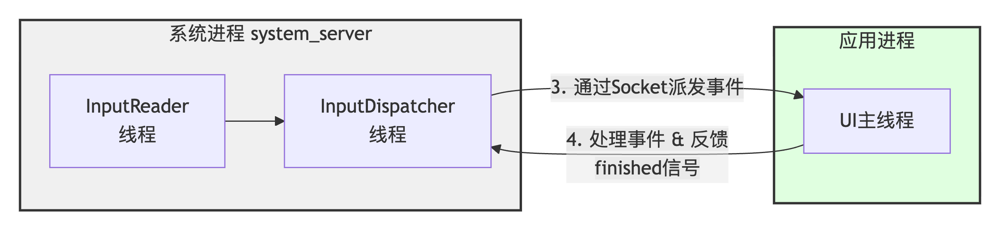

# 什么是ANR？

ANR 全称 Applicatipon No Response；Android 设计 ANR 的用意，是系统通过与之交互的组件(Activity，Service，Receiver，Provider)以及用户交互(InputEvent)进行超时监控，以判断应用进程(主线程)是否存在卡死或响应过慢的问题，通俗来说就是很多系统中看门狗(watchdog)的设计思想。

## ANR产生的机制

系统在通过 Binder 通信向应用进程发送上述组件消息或 Input 事件时，在 AMS 或 Input 服务端同时设置一个异步超时监控。当然针对不同类型事件，设置的超时时长也存在差别，以下是 Android 系统对不同类型的超时阈值设置：（activty和finalizer是哪儿来的？？？）

### Input类型的ANR如何触发的？

**正常的Input处理流程：**

1. **InputReader** 运行在系统进程的线程中，它负责从硬件读取原始输入事件 。
2. **InputDispatcher** 也运行在系统进程的另一个线程中，它是“事件中转调度中心”，从 InputReader 那拿到事件后，负责找到合适的应用窗口并将事件派发过去 。
3. **UI主线程（应用进程）** 接收事件并处理。处理完成后，会通过 Socket 向 `InputDispatcher` 发送一个 `finished` 信号，告知事件处理完毕 。

**Input anr计时器如何埋的：**

ANR 的计时器并不是一上来就开始倒计时的，它的启动需要一个“导火索”。这个机制可以概括为 **“一次无响应，二次定乾坤”** 。

* **等待检测**：当 `InputDispatcher` 向应用派发第一个事件（事件 A）后，会开始等待应用的 `finished` 信号。如果超过 **500ms** 仍无反馈，`InputDispatcher` 并不会立即判定 ANR，而是认为应用可能“卡”了一下，开始警惕起来 。
* **超时判定**：如果在这之后，**第二个事件（事件 B）** 到来，`InputDispatcher` 发现事件 A 依然没有被处理完毕。这时，它就会认为应用已经失去了响应能力，于是正式启动一个 **5秒** 的 ANR 超时计时器 。

简单来说，**5秒 ANR 超时是从第二个事件到达时开始计算的**。如果在接下来的 5 秒内，第一个事件依然没有被处理完并反馈，ANR 就会被触发。

**检测到ANR后系统如何做**

1. **记录现场**：将当前时间、出问题的窗口、等待时长等信息保存到 `mLastANRState` 中，这些信息最终会出现在 `trace` 文件里。
2. **发布命令**：将一个 `doNotifyANRLockedInterruptible` 命令加入到 `InputDispatcher` 的命令队列中。在 `InputDispatcher` 的下一个派发循环中，这个命令会被执行，通过一系列 JNI 调用，最终通知到 Java 层的 `ActivityManagerService` ：NativeInputManager.notifyANR(...)`→`InputManagerService.notifyANR(...)`→`InputMonitor.notifyANR(...)` → **`ActivityManagerService.inputDispatchingTimedOut(...)`， 到达 `ActivityManagerService` 后，ANR 的处理就进入了我们熟悉的流程：收集各种信息（如 CPU 使用率、Trace 堆栈），最终向用户展示“应用无响应”的对话框 。

### ANR trace dump流程

1. 调用AMS接口，进行ANR信息收集；AMS会进行环境判断，以过滤当前进程是不是已经发生并正在执行 Dump 流程，或者已经发生 Crash，或者已经被系统 Kill 之类的情况。
2. 然后开始统计与该进程有关联的进程，或系统核心服务进程的信息；例如与应用进程经常交互的 SurfaceFligner，SystemServer 等系统进程，如果这些系统服务进程在响应时被阻塞，那么将导致应用进程 IPC 通信过程被卡死。
3. 搜集的进程包括自身SystemServer进程、发生anr的进程、其他init进程创建的进程等。
4. 建立IPC，向各进程发送SIGQUIT，各进程开始收集堆栈信息，并发送给SystemServer，由SystemServer写入data/anr/trace。

### 应用层如何监控ANR

1. 主线程watchdog，发送探测消息。不等于发生ANR，需要进一步验证。
2. **监听 SIGNALQUIT 信号**，自己注册一个SIGNALQUIT，但是注意会覆盖原有的SIGQUIT，所以要在适当时候回复。当接收到该信号时，过滤场景，确定是发生用户可感知的 ANR 之后，从 Java 层获取各线程堆栈，或通过反射方式获取到虚拟机内部 Dump 线程堆栈的接口，在内存映射的函数地址，强制调用该接口，并将数据重定向输出到本地。

**第二种方案从思路上来说优于第一种方案，并且遵循系统信息获取方式，获取的线程信息及虚拟机信息更加全面，但缺点是对性能影响比较大，对于复杂的 App 来说，统计其耗时，部分场景一次 Dump 耗时可能要超过 10S。**

### 字节Raster监控工具

该工具主要是在主线程消息调度过程进行监控，并按照一定策略聚合，以保证监控工具本身对应用性能和内存抖动影响降至最低。同时对应用四大组件消息执行过程进行监控，便于对这类消息的调度及耗时情况进行跟踪和记录。另外对当前正在调度的消息及消息队列中待调度消息进行统计，从而在发生问题时，可以回放主线程的整体调度情况。此外，我们将系统服务的 CheckTime 机制迁移到应用侧，应用为线程 CheckTime 机制，以便于系统信息不足时，从线程调度及时性推测过去一段时间系统负载和调度情况。

当前主线程堆栈不一定是ANR的原因，所以要想办法记录前x个消息的执行情况。所以按照一定的聚合策略和规则，把ANR前的消息堆栈一并上报。

## 如何排查？怎么看TRACE？

### 主线程状态

| 线程状态 (Status)           | 核心含义                                                     | 在Trace文件中的表现形式与调试价值                                                                                                                                                                                     |
| --------------------------- | ------------------------------------------------------------ | --------------------------------------------------------------------------------------------------------------------------------------------------------------------------------------------------------------------- |
| **Running / Runnable**      | 线程正在占用CPU执行代码，或者处于就绪队列中等待CPU调度。     | **最常见的“实锤”状态**。若主线程（main）为Runnable且堆栈指向你的代码（如文件读写、Bitmap处理、复杂计算），说明此处就是耗时操作的根源。                                                                              |
| **Native**                  | 线程正在执行Native代码（JNI方法）或系统调用。                | **需要仔细分析的“混沌”状态**： • **nativePollOnce**：主线程空闲等待新消息，是健康状态。 • **read/write**：I/O阻塞，通常是文件或网络读写瓶颈。 • **Binder线程调用**：等待系统服务响应，可能对端卡顿。 |
| **Blocked / Monitor**       | 线程阻塞，等待获取对象锁（synchronized）。                   | **“锁竞争”的典型信号**。搜索trace文件中持有该锁的线程（通常有`locked <...>`标记），分析它为何不释放锁。                                                                                                             |
| **Waiting**                 | 线程无限期等待，通过`Object.wait()`等方法，需其他线程唤醒。  | 若主线程在此状态且无其他线程唤醒，就会ANR。需找出本该唤醒它的线程在做什么。                                                                                                                                           |
| **TimedWaiting / Sleeping** | 线程有限期等待，如`Thread.sleep()`、`Object.wait(timeout)`。 | 主线程在此状态过久也会ANR。结合堆栈判断睡眠时间是否合理。                                                                                                                                                             |
| **Suspended**               | 线程被暂停，通常因GC或Debugger操作。                         | 若伴随长时间GC，说明内存压力大；若`dsCount`（被调试器挂起次数）不为0，可能是开发调试导致，需区分真实用户场景。                                                                                                        |

### 线程耗时 utm stm

表示该线程从创建到现在，被 CPU 调度的真实运行时长，不包括线程等待或者 Sleep 耗时，其中线程 CPU 耗时又可以进一步分为用户空间耗时(utm)和系统空间耗时(stm)，这里的单位是 jiffies，当 HZ=100 时，1utm 等于 10ms。

**utm：** Java 层和 Native 层非 Kernel 层系统调用的逻辑，执行时间都会被统计为用户空间耗时；

**stm：** 即系统空间耗时，一般调用 Kernel 层 API 过程中会进行空间切换，由用户空间切换到 Kernel 空间，在 Kernel 层执行的逻辑耗时会被统计为 stm，如文件操作，open,write,read 等等；

### schedstat schedstat=(123456789 987654321 54321)

**第一个数**：累计 CPU 时间（纳秒），相当于累计的 CPU 执行时间，和 `utm+stm` 描述的是同一件事，只是单位更精细。

**第二个数**：累计等待时间（纳秒）—— **重点关注**，**这是最关键的数据**。它记录了线程**已经处于可运行状态（Runnable），但因为没有空闲 CPU 而不得不等待调度**的总时长。这个值就是常说的 **`run delay`**（调度延迟）。

**第三个数**：调度次数，线程被调度器选中并运行了多少次，可以理解为“上线次数”。

### AnrInfo 信息

**ANR类型(longmsg)**

表示当前是哪种类型的消息或应用组件导致的 ANR，如 Input，Receiver，Service 等等。

**系统负载(Load)**

表示不同时间段的系统整体负载，如："Load：45.53 / 27.94 / 19.57"，分布代表 ANR 发生前 1 分钟，前 5 分钟，前 15 分钟各个时间段系统 CPU 负载，具体数值代表单位时间等待系统调度的任务数(可以理解为线程)。如果这个数值过高，则表示当前系统中面临 CPU 或 IO 竞争，此时，普通进程或线程调度将会受到影响。如果手机处于温度过高或低电等场景，系统会进行限频，甚至限核，此时系统调度能力也会受到影响。

此外，可以将这些时间段的负载和应用进程启动时长进行关联。如果进程刚启动 1 分钟，但是从 Load 数据看到前 5 分钟，甚至前 15 分钟系统负载已经很高，那很大程度说明本次 ANR 在很大程度会受到系统环境影响。

**进程 CPU 使用率**

如上图，表示当前 ANR 问题发生之前(CPU usage from XXX to XXX ago)或发生之后(CPU usage from XXX to XXX later)一段时间内，都有哪些进程占用 CPU 较高，并列出这些进程的 user，kernel 的 CPU 占比。当然很多场景会出现 system\_server 进程 CPU 占比较高的现象，针对这个进程需要视情况而定.

minor 表示次要页错误，文件或其它内存被加载到内存后，但是没有被映射到当前进程，通过内核访问时，会触发一次 Page Fault。如果访问的内容还没有加载到内存，那么会触发 major，所以对比可以看到，major 的系统开销会比 minor 大很多。

* ##### 关键进程：

  * **kswapd：** 是 linux 中用于页面回收的内核线程，主要用来维护可用内存与文件缓存的平衡，以追求性能最大化，当该线程 CPU 占用过高，说明系统可用内存紧张，或者内存碎片化严重，需要进行 file cache 回写或者内存交换(交换到磁盘)，线程 CPU 过高则系统整体性能将会明显下降，进而影响所有应用调度。
  * **mmcqd：** 内核线程，主要作用是把上层的 IO 请求进行统一管理和转发到 Driver 层，当该线程 CPU 占用过高，说明系统存在大量文件读写，当然如果内存紧张也会触发文件回写和内存交换到磁盘，所以 kswapd 和 mmcqd 经常是同步出现的。

### 总结

在上面我们对各类日志的关键信息进行了基本释义，下面就来介绍一下，当我们日常遇到 ANR 问题时，是如何分析的，总结思路如下：

* **分析堆栈**，看看是否存在明显业务问题(如死锁，业务严重耗时等等)，如果无上述明显问题，则进一步通过 ANR Info 观察系统负载是否过高，进而导致整体性能较差，如 CPU，Mem，IO。然后再进一步分析是本进程还是其它进程导致，最后再分析进程内部分析对比各个线程 CPU 占比，找出可疑线程。
* 综合上述信息，利用监控工具收集的信息，观察和找出 ANR 发生前一段时间内，主线程耗时较长的消息都有哪些，并查看这些耗时较长的消息执行过程中采样堆栈，根据堆栈聚合展示，进一步的对比当前耗时严重的接口或业务逻辑。

#### 一看 Trace：

* **死锁堆栈：** 观察 Trace 堆栈，确认是否有明显问题，如主线程是否与其他线程发生死锁，如果是进程内部发生了死锁，那么恭喜，这类问题就清晰多了，只需找到与当前线程死锁的线程，问题即可解决；
* **业务堆栈：** 观察通过 Trace 堆栈，发现当前主线程堆栈正在执行业务逻辑，你找到对应的业务同学，他承认该业务逻辑确实存在性能问题，那么恭喜，你很有可能解决了该问题，为什么只是有可能解决该问题呢？因为有些问题取决于技术栈或框架设计，无法在短时间内解决。如果业务同学反馈当前业务很简单，基本不怎么耗时，而这种场景也是日常经常遇到的一类问题，那么就可能需要借助我们的监控工具，追溯历史消息耗时情况了；
* **IPC Block 堆栈：** 观察通过 Trace 堆栈，发现主线程堆栈是在跨进程(Binder)通信，那么这个情况并不能当即下定论就是 IPC block 导致，实际情况也有可能是刚发送 Binder 请求不久，以及想要进一步的分析定位，这时也需要借助我们的自研监控工具了；
* **系统堆栈：** 通过观察 Trace，发现当前堆栈只是简单的系统堆栈，想要搞清楚是否发生严重耗时，以及进一步的分析定位，如我们常见的 NativePollOnce 场景，那么也需要借助我们的自研监控工具进一步确认了。

#### **二看**关键字：**Load，CPU，Slow Operation，Kswapd，Mmcqd，Kwork，Lowmemkiller 等等**

刚才我们介绍到，上面这些关键字是反应系统 CPU，Mem，IO 负载的关键信息，在分析完主线程堆栈信息之后，还需要进一步在 ANRInfo，logcat 或 Kernel 日志中搜索这些关键字，并根据这些关键字当前数值，判断当前系统是否存在资源(CPU，Mem，IO)紧张的情况；

#### 三看系统负载分布：观察系统整体负载：User,Sys,IOWait

通过观察系统负载，则可以进一步明确是 CPU 资源紧张，还是 IO 资源紧张；如果系统负载过高，一定是有某个进程或多个进程引起的。反之系统负载过高又会影响到所有进程调度性能。通过观察 User，Sys 的 CPU 占比，可以进一步发分析当前负载过高是发生在应用空间，还是系统空间，如大量调用逻辑(如文件读写，内存紧张导致系统不断回收内存等等)，知道这些之后，排查方向又会进一步缩小范围。

#### 四**看进程 CPU：观察 Top 进程的 CPU 占比**

从上面分析，在我们知道当前系统负载过高，是发生在用户空间还是内核空间之后，那么我们就要通过 Anrinfo 的提供的进程 CPU 列表，进一步锁定是哪个(些)进程导致的，这时则要进一步的观察每个进程的 CPU 占比，以及进程内部 user，sys 占比。

* 在分析进程 CPU 占比过程，有一个关键的信息，**要看统计这些进程 CPU 过高的场景是发生在 ANR 之前的一段时间还是之后一段时间**，如下图表示 ANR 之前 4339ms 到 22895ms 时间内进程的 CPU 使用率。

#### 五看 CPU 占比定线程 **：对比各线程 CPU 占比，以及线程内部 user 和 kernel 占比**

在通过系统负载(user,sys,iowait)锁定方向之后，又通过进程列表锁定目标进程，那么接下来我们就可以从目标进程内部分析各个线程的(utm,stm)，进一步分析是哪个线程有问题了。

在 Trace 日志的线程信息里可以清晰的看到每个线程的 utm，stm 耗时。至此我们就完成了从系统到进程，再到进程内部线程方向的负载分析和排查。当然，有时候可能导致系统高负载的不是当前进程，而是其他进程导致，这时同样会影响其他进程，进而导致 ANR。

#### 六看消息调度锁定细节 **：**

在分析和明确系统负载是否正常，以及负载过高是哪个进程引起的结论之后，接下来便要通过我们的监控工具，进一步排查是当前消息调度耗时导致，历史消息调度耗时导致，还是消息过于频繁导致。同时通过我们的线程 CheckTime 调度情况分析当前进程的 CPU 调度是否及时以及影响程度，在锁定上述场景之后，再进一步分析耗时消息的采样堆栈，才算找到解决问题的终极之钥。当然耗时消息内部可能存在一个或多个耗时较长的函数接口，或者会有多个消息存在耗时较长的函数接口，这就是我们前文中提到的：“发生 ANR 时，没有一个消息是无辜的”
